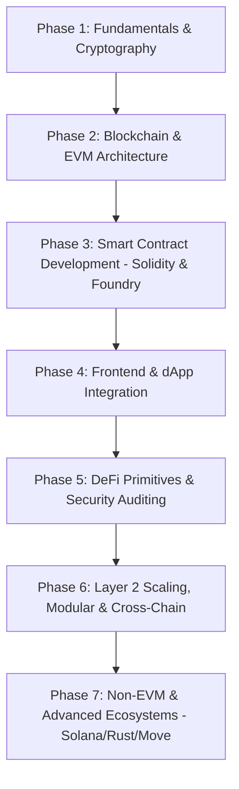

# Comprehensive Web3 Developer Roadmap

---

## 🗺️ Visual Architecture & Roadmap Overview

---

## 📌 Phase 1: Foundations & Cryptography Basics (2–3 Weeks)

Before diving into smart contracts, master the foundational cryptography and networking concepts.

### 1. Cryptography Primitives
- **Hashing Algorithms:** SHA-256, Keccak-256 (used in Ethereum).
- **Asymmetric Cryptography:** Public & Private key pairs, Elliptic Curve Cryptography (ECDSA - secp256k1, Ed25519).
- **Digital Signatures:** Signing messages, verification, `ecrecover`.
- **Data Structures:** Merkle Trees, Merkle Proofs, Patricia Tries, Verkle Trees.

### 2. Networking & Distributed Systems
- Peer-to-Peer (P2P) networking (Kademlia DHT, libp2p).
- Byzantine Fault Tolerance (BFT) & distributed consensus basics.
- CAP Theorem in decentralized environments.

---

## ⛓️ Phase 2: Blockchain & EVM Architecture (3–4 Weeks)

Understand how decentralized state machines execute and maintain consensus.

### 1. Blockchain Mechanics
- **Blocks & Chains:** Block headers, nonce, difficulty, parent hash, state root, receipt root.
- **Consensus Mechanisms:**
  - Proof of Work (PoW)
  - Proof of Stake (PoS - Ethereum Gasper: Casper FFG + LMD GHOST)
  - Delegated Proof of Stake (DPoS), Proof of Authority (PoA).
- **Accounts:** Externally Owned Accounts (EOAs) vs. Contract Accounts.

### 2. EVM (Ethereum Virtual Machine) Deep Dive
- **State Transition Machine:** World state, storage, stack, memory, calldata.
- **Gas Model:** Gas limit, base fee, priority fee (EIP-1559), opcode gas costs.
- **Node Infrastructure:** Execution Clients (Geth, Nethermind, Besu, Reth) vs. Consensus Clients (Prysm, Lighthouse, Teku).
- **RPC & Communication:** JSON-RPC spec, WebSocket subscriptions, Infura/Alchemy/QuickNode/Local nodes.

---

## 📜 Phase 3: Smart Contract Development (6–8 Weeks)

Solidity is the primary language of the EVM ecosystem.

### 1. Solidity Core to Advanced
- **Syntax & Basics:** Types, storage vs. memory vs. calldata, functions, visibility (`public`, `external`, `internal`, `private`), modifiers, events, custom errors.
- **OOP & Patterns:** Interfaces, abstract contracts, libraries, multiple inheritance (`override`, `super`).
- **EVM Assembly (Yul):** Inline assembly, raw memory manipulation, custom opcodes (`sload`, `sstore`, `mload`, `mstore`, `create2`).

### 2. Modern Development Tooling
- **Foundry (Industry Standard):**
  - `forge` (compilation, testing, fuzzing, differential testing, invariant testing).
  - `cast` (CLI interaction with smart contracts and RPC nodes).
  - `anvil` (fast local testnet).
- **Hardhat:** JavaScript/TypeScript testing, plugins, console logging.

### 3. Core Standards (OpenZeppelin)
- **ERC-20:** Fungible tokens, permit (EIP-2612).
- **ERC-721 / ERC-721A:** Non-fungible tokens, gas-optimized batch minting.
- **ERC-1155:** Multi-token standard.
- **ERC-4626:** Tokenized Vault Standard (DeFi yield vaults).
- **ERC-4337:** Account Abstraction (Smart contract wallets, Paymasters, Bundlers, UserOperations).

### 4. Smart Contract Upgradability Patterns
- Transparent Proxy Pattern
- UUPS (Universal Upgradeable Proxy Standard - ERC-1822)
- Diamond Pattern (Multi-facet proxy - ERC-2535)
- Beacon Proxy

---

## 🌐 Phase 4: Frontend & Full-Stack dApp Engineering (4–5 Weeks)

Connect client applications directly to smart contracts on-chain.

### 1. Web3 Libraries & Hooks
- **viem:** Lightweight, type-safe, low-level Ethereum interface.
- **wagmi:** React hooks for Ethereum applications.
- **ethers.js (v6) & web3.js:** Legacy and versatile integration libraries.
- **Wallet Connection Kits:** RainbowKit, AppKit (Web3Modal), Dynamic, Privi.

### 2. Indexing & Event Querying
- **The Graph:** Building, deploying, and querying custom Subgraphs (GraphQL).
- **Modern Indexers:** Goldsky, Envio, GhostGraph, Ponder.
- **Direct RPC Log filtering:** `eth_getLogs`.

### 3. Decentralized Storage & Oracles
- **Decentralized Storage:** IPFS (Pinata, Web3.Storage), Arweave, Filecoin.
- **Oracles:**
  - Chainlink (Price Feeds, VRF for randomness, CCIP for cross-chain, Automation).
  - Pyth Network (Low-latency pull oracles).

---

## 🛡️ Phase 5: DeFi Primitives & Security Auditing (6–8 Weeks)

DeFi is the core financial engine of Web3, and security is paramount.

### 1. DeFi Core Protocols
- **Automated Market Makers (AMMs):**
  - Constant Product: Uniswap v2 ($x \cdot y = k$).
  - Concentrated Liquidity: Uniswap v3 & v4 hooks.
  - Stableswaps: Curve Finance.
- **Lending & Borrowing:** Over-collateralized loans, liquidation mechanics, interest rate models (Aave, Compound).
- **Liquid Staking & Restaking:** Lido (stETH), EigenLayer (AVS - Actively Validated Services).
- **Flash Loans:** Uncollateralized single-transaction borrowing.

### 2. Smart Contract Security & Vulnerabilities
- **Top Vulnerabilities:**
  - Reentrancy (Single-function, Cross-function, Read-only reentrancy).
  - Arithmetic overflow/underflow & precision loss.
  - Flash loan price manipulation / Spot price dependency.
  - Front-running, Sandwich Attacks, MEV (Maximal Extractable Value).
  - Signature replay & malleability (EIP-712).
  - Access control flaws & unchecked return values.
- **Static Analysis & Testing Tools:**
  - Slither, Aderyn (Static analysis).
  - Echidna, Medusa (Property-based fuzzing).
  - Mythril, Certora (Formal verification).
- **Competitive Auditing Platforms:** Code4rena, Sherlock, Cantina, Immunefi bug bounties.

---

## 🚀 Phase 6: Layer 2s, Modular Blockchains & Cross-Chain (3–4 Weeks)

Scaling Ethereum and multi-chain architecture.

### 1. Layer 2 Rollups
- **Optimistic Rollups:** Arbitrum, Optimism (OP Stack), Base (Fraud proofs).
- **Zero-Knowledge (ZK) Rollups:** zkSync Era, Starknet, Scroll, Linea, Polygon zkEVM (Validity proofs, STARKs/SNARKs).
- **Data Availability (DA) Layer:** EIP-4844 (Proto-Danksharding, Blobs), Celestia, EigenDA.

### 2. Cross-Chain Interoperability
- **Messaging Protocols:** Chainlink CCIP, LayerZero, Wormhole, Axelar.
- Bridge architecture, risks, and proof verification.

---

## 🦀 Phase 7: Non-EVM Ecosystems (Optional / High Demand) (4–6 Weeks)

Diversify your skills beyond the EVM.

### 1. Solana
- Language: **Rust**.
- Framework: **Anchor**.
- Architecture: Account model, parallel transaction execution (Sealevel), high throughput.
- Tooling: Solana CLI, `@solana/web3.js`, Coral.

### 2. Move-based Blockchains
- Language: **Move** (Object-centric, linear types for asset safety).
- Networks: **Sui**, **Aptos**.

---

## 🛠️ Recommended Project Portfolio Checklist

Build these projects to establish industry-level credibility:

1. **Decentralized Exchange (DEX):** Token swap pool + liquidity provider shares + Uniswap v2 fork with custom fee mechanics.
2. **NFT Marketplace:** Escrow-based trading, auction system (English & Dutch), royalty enforcement, ERC-2981.
3. **Decentralized Lending Protocol:** Supply collateral, borrow assets, calculate health factor, trigger liquidations.
4. **Account Abstraction Smart Wallet (ERC-4337):** Social recovery, gas sponsorship via paymaster, bundled operations.
5. **Cross-Chain Asset Bridge / CCIP App:** Lock-and-mint or burn-and-mint bridge across testnets using Chainlink CCIP.
6. **Full-Stack dApp with Subgraph:** Custom smart contracts + Subgraph indexing + Next.js/Wagmi/RainbowKit UI.

---

## 📚 Best Resources

| Category | Resources |
| :--- | :--- |
| **Interactive Tutorials** | CryptoZombies, SpeedRunEthereum (Austin Griffith), RareSkills |
| **Solidity & Security** | Solidity by Example, RareSkills Blog, OpenZeppelin Docs, Damn Vulnerable DeFi, Ethernaut |
| **Frameworks** | Foundry Book (`book.getfoundry.sh`), Hardhat Docs |
| **Research & Standards** | Ethereum EIPs/ERCs repository, Ethresear.ch, Paradigm Research |
